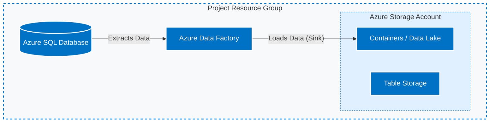

# ☁️ Azure Data Ingestion Pipeline: SQL to Data Lake

> This project demonstrates an end-to-end data pipeline built in Azure to learn how to orchestrate and manage data in the cloud. The pipeline securely takes data from an Azure SQL Database (source) and lands it safely into an Azure Data Lake (destination) using Azure Data Factory.

---

## 🏗️ Architecture Overview

The infrastructure is logically grouped within a single Azure Resource Group. Azure Data Factory acts as the main engine, securely connecting to the SQL database, pulling the data, and loading it into the Storage Account.

## 🚀 What I Deployed

| Resource Type | What I Used It For |
| :--- | :--- |
| **Azure SQL Server & Database** | This is the **Source**. It holds the initial relational data that needs to be migrated or analyzed. |
| **Azure Data Factory (ADF)** | The main orchestrator. It hosts the automated pipeline logic (validation and data copy) for data movement. |
| **Azure Storage Account (Data Lake)** | This is the **Sink/Destination**. I used the **Containers** service (ADLS Gen2) to store the raw data files. |
| **Azure Storage Account (Tables)** | Utilized to store structured, non-relational data, separate from the primary data lake containers. |

## ⚙️ How I Built It

1. **Setting up the Source:** I spun up an Azure SQL Server and created a SQL Database to hold my starting dataset.
2. **Setting up the Destination:** I created an Azure Storage Account.
   * *Note: Azure Storage Accounts actually give you 4 different options (Containers, File Shares, Queues, and Tables).* 
   * For this project, I used **Containers** for the Data Lake sink, and **Tables** for separate structured data.
3. **Connecting the Dots (Data Integration):** 
   * I created my Azure Data Factory instance.
   * I set up "Linked Services" (basically secure connection strings) for both the SQL DB and the Storage Account.
   * Finally, I built the pipeline to automate moving the data from the source to the sink.

## 🚧 Roadblocks & How I Fixed Them

Like any cloud project, things didn't work perfectly on the first try. Here are a few hurdles I ran into and how I solved them:

* **Azure SQL Firewall Blocks:** 
  * *The Issue:* When I first tried to connect Data Factory to SQL, it failed. By default, Azure SQL blocks all outside traffic.
  * *The Fix:* I had to go into the SQL Server networking settings and check the box for **"Allow Azure services and resources to access this server"** so my pipeline could get through.
* **Figuring Out Permissions:**
  * *The Issue:* I needed Data Factory to write to my Storage Account, but I didn't want to use raw, hardcoded access keys (bad practice!).
  * *The Fix:* I used a System-Assigned Managed Identity (SAMI). I basically gave my Data Factory instance the **"Storage Blob Data Contributor"** role on the storage account so they could securely talk to each other.
* **Schema Headaches:**
  * *The Issue:* Moving strict, typed data from a SQL table into a flexible Data Lake file can cause formatting errors.
  * *The Fix:* I spent some time configuring explicit schema mappings inside my ADF *Copy Data Activity* to make sure the columns lined up perfectly when they landed in the destination.
* **Pipeline Validation Failures:**
  * *The Issue:* The pipeline would occasionally fail on the `ValidationSQLData` step.
  * *The Fix:* This was usually because the SQL table it was looking for had not yet been fully populated by an upstream process. I adjusted the validation parameters and added a slightly longer timeout period to account for data loading times.

## 💡 What I Learned

* **Storage is Flexible:** It was really cool to see how one single Azure Storage Account could handle completely different types of storage (Blob Containers vs. NoSQL Tables) under the same roof.
* **Pipelines are Powerful:** Getting hands-on with Azure Data Factory really showed me how easy it can be to automate complex data movement once the connections (Linked Services) are set up correctly.

---

### Pipeline Design

Here is the visual design of the actual Azure Data Factory pipeline created for this project.

This pipeline features a robust, two-step design:
1.  A **Validation** activity named `ValidationSQLData` first confirms that the source data is present and ready in the SQL database.
2.  Upon a successful validation check, a **Copy Data** activity named `migrateSqlData` is triggered to perform the actual data migration from the SQL source to the Data Lake sink.

For details on the pipeline activities, linked services, and datasets, you can reference the full ARM template files in this repository.
